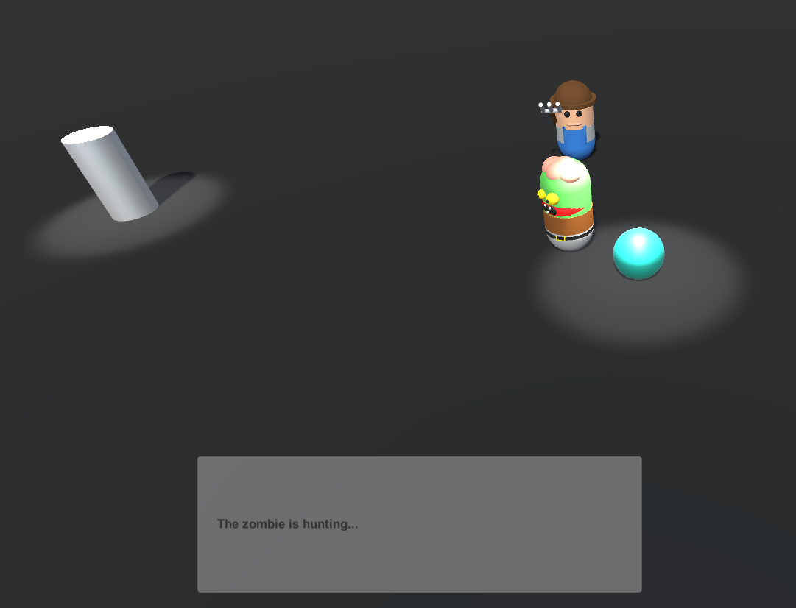
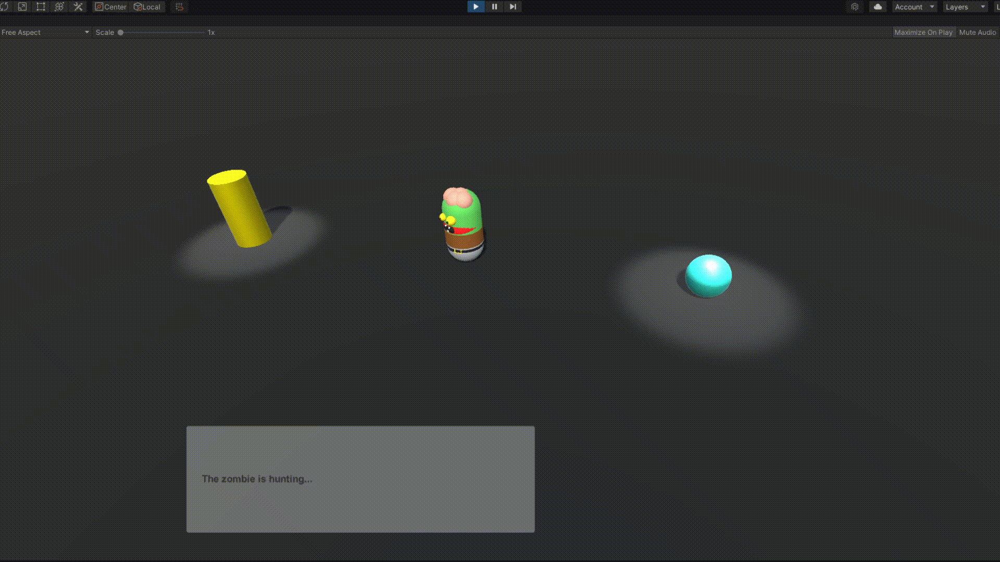
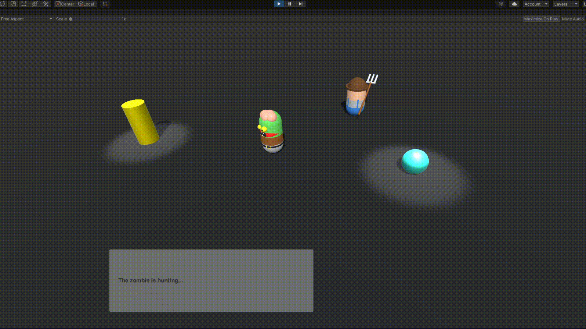
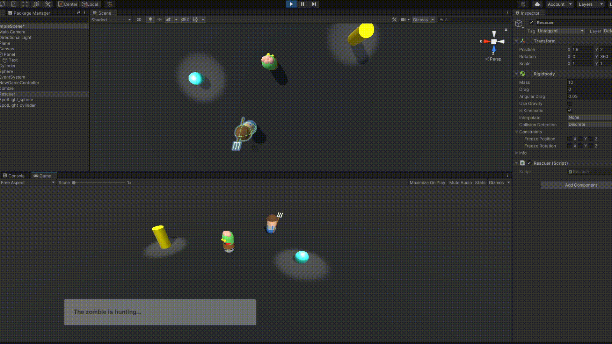

# Práctica 3: Delegados y eventos
* Asignatura: Interfaces Inteligentes
* Autora: Vanessa Valentina Villalba Pérez
* Correo: alu0101265704@ull.edu.es

### Información acerca de la escena

Para la realización de esta práctica se ha decidido utilizar un plano, en el cual se pueden visualizar los siguientes elementos:

* Esfera azul, correspondiente con los objetos de tipo A.
* Cilindro amarillo, correspondiente con los objetos de tipo B.
* Elementos provenientes del Asset [Easy Primitive People](https://assetstore.unity.com/packages/3d/characters/easy-primitive-people-161846), de los cuales:
  
  * El jugador, corresponde con el "Zombie" verde.
  * El rescatador o sobreviviente, corresponde con la persona con el rastrillo en la mano.
  


### Objetivos de la práctica y pasos realizados

1. **Cuando el jugador colisiona con un objeto de tipo B, el objeto A mostrará un texto en una UI de Unity. Cuando toca el objeto A se incrementará la fuerza del objeto B**

En primer lugar, se añade un Canvas a la escena el cual además de contener el recuadro de texto, contendrá un panel para una mejor visualización del mismo.

Se crea un script por cada tipo de objeto en la escena (donde las clases son públicas) [ObjectA.cs](scripts/ObjectA.cs), [ObjectB.cs](scripts/ObjectB.cs) y [PlayerMovement.cs](scripts/PlayerMovement.cs). 

Principalmente, para hacer uso de los delegados y eventos, dentro de cada fichero bien sea del objeto A o del B, se crean sus correspondientes delegados a los que progresivamente se le irán añadiendo los eventos necesarios. En este caso, Para gestionar las colisiones se hace uso del OnCollisionEnter y del OnCollisionExit, de esa manera se pueden ejecutar los eventos correspondientes al momento de colisionar el jugador con algún objeto.

```
public class ObjectA : MonoBehaviour {
    public delegate void delegateCollisionA();
    public static event delegateCollisionA eventCollisionA;
    GameObject Player;
    public Text DisplayText;

    void Start() 
    {
        Player = GameObject.FindGameObjectWithTag("Player");
        ObjectB.eventCollisionB += changeText;
    }

    void  OnCollisionEnter(Collision collision)
    {
        if (collision.gameObject.tag == "Player" && eventCollisionA != null) 
        {
            eventCollisionA();
        }
    }

    void  OnCollisionExit(Collision collision) 
    {
        if (collision.gameObject.tag == "Player") 
        {
            DisplayText.text = "The zombie is hunting...";
        }
    }

    void changeText() 
    {
        DisplayText.text = "Object A: OH NO! The zombie attacked the Object B";
    }
}
```

```public class ObjectB : MonoBehaviour {
    public delegate void delegateCollisionB();
    public static event delegateCollisionB eventCollisionB;
    public Text DisplayText;
    private int force;

    void Start() 
    {
        force = 0;
        ObjectA.eventCollisionA += increaseForce;
    }

    void  OnCollisionEnter(Collision collision) 
    {
        if (collision.gameObject.tag == "Player" && eventCollisionB != null) 
        {
            eventCollisionB();
        }
    }

    void  OnCollisionExit(Collision collision) 
    {
        if (collision.gameObject.tag == "Player") 
        {
            DisplayText.text = "The zombie is hunting...";
        }
    }

    void increaseForce() 
    {
        force++;
        DisplayText.text = "Object B: My force is incremented to... " + force + " I'm strong!";
    }
}
```



**IMPORTANTE:** Adicionalmente, se creó un script para generar dos spot lights capaces de seguir al cilindro y a la esfera. [LightFollow.cs](scripts/LightFollow.cs)

```
public class LightFollow : MonoBehaviour
{
    public GameObject player;

    void Update()
    {
       transform.LookAt(player.transform); 
    }
}
```

2. **Cuando el jugador se aproxima a los cilindros de tipo A, los cilindros de tipo B cambian su color y las esferas se orientan hacia un objetivo ubicado en la escena con ese propósito. Consultar información de la clase Vector3: LookAt, RotateTowards, ...**

En este caso, ya que se ha creado el delegado correspondiente al objeto A, lo que se hace es crear dos eventos, uno correspondiente a lo que sucede cuando el jugador se encuentra cerca del objeto y otro para cuando este se aleja, llamados ` public static event delegateCollisionA eventCloserDistanceA` y `public static event delegateCollisionA eventInitialPosA;`. 

Entonces, como es necesario verificar en cada momento en qué posición se encuentra el jugador, se ha desarrollado el método Update sonde dependiendo de la distancia a la que se encuentre respecto al Objecto A, se encarga de lanzar un evento u otro.

```
void Update() 
    {
        DistanceWithPlayer = Vector3.Distance(transform.position, Player.transform.position);
        if (DistanceWithPlayer <= 3.0f) 
        {
            eventCloserDistanceA();
        } else {
            eventInitialPosA();
        }
    }
```

Y, el código para el objeto B, queda de la siguiente manera, ya que debe cambiar el color del cilindro. En este caso, cambia de amarillo a blanco:

```
public class ObjectB : MonoBehaviour {
    public delegate void delegateCollisionB();
    public static event delegateCollisionB eventCollisionB;
    public Text DisplayText;
    private int force;

    void Start() 
    {
        force = 0;
        ObjectA.eventCollisionA += increaseForce;
        ObjectA.eventCloserDistanceA += changeColor;
        ObjectA.eventInitialPosA += changeToInitialColor;
    }

    void  OnCollisionEnter(Collision collision) 
    {
        if (collision.gameObject.tag == "Player" && eventCollisionB != null) 
        {
            eventCollisionB();
        }
    }

    void  OnCollisionExit(Collision collision) 
    {
        if (collision.gameObject.tag == "Player") 
        {
            DisplayText.text = "The zombie is hunting...";
        }
    }

    void increaseForce() 
    {
        force++;
        DisplayText.text = "Object B: My force is incremented to... " + force + " I'm strong!";
    }

    void changeColor() 
    {
        GetComponent<Renderer>().material.color = Color.white;
    }

    void changeToInitialColor() 
    {
        GetComponent<Renderer>().material.color = Color.yellow;
    }
}
```

Y, el jugador que se rota sería de la siguiente manera:
```
public class Rescuer : MonoBehaviour
{
    Transform target;
    void Start()
    {
        ObjectA.eventCloserDistanceA += LookAtTarget;
        ObjectA.eventInitialPosA += ChangeToInitialPos;
        target = GameObject.FindWithTag("Player").GetComponent<Transform>();
    }

    public void LookAtTarget()
    {
        Debug.DrawRay(transform.position, transform.forward * 10, Color.white, 0.1f, true);
        transform.LookAt(target);
    }

    public void ChangeToInitialPos()
    {
        transform.rotation = Quaternion.identity;
    }
}
```



**IMPORTANTE:** Para facilitar la visualización de los diferentes apartados sin necesidad de tener que borrar los scripts a medida que se iba avanzando en la práctica, se creó un script para la cámara principal capaz de seguir al jugador y así poder visualizar la escena entera. [PlayerCamera.cs](scripts/PlayerCamera.cs)

```
public class PlayerCamera : MonoBehaviour
{
    Transform PlayerTransform;
    private Vector3 CameraOffset;
    public bool isLookAtPlayer = false;

    [Range(0.01f, 1.0f)]
    public float SmoothFactor = 0.5f;

    void Start()
    {
        PlayerTransform = GameObject.FindWithTag("Player").GetComponent<Transform>();
        CameraOffset = transform.position - PlayerTransform.position;
    }

    void LateUpdate()
    {
        Vector3 NewPosition = PlayerTransform.position + CameraOffset;
        transform.position = Vector3.Slerp(transform.position, NewPosition, SmoothFactor);
        if (isLookAtPlayer)
            transform.LookAt(PlayerTransform);
    }
}
```

3. **Implementar un controlador que mueva el objeto con wasd**

Ya que el jugador hace referencia a un game object del tipo Rigid body se cambia directamente su posición, además, desde el instructor se da la posibilidad de cambiar la velocidad del mismo:

```
public class PlayerMovement : MonoBehaviour {
    public float speed = 20f;
    public Rigidbody rb;
    Vector3 movement;

    void Start() 
    {
        rb = GameObject.FindWithTag("Player").GetComponent<Rigidbody>();
    }

    void Update() 
    {
        if (Input.GetKey(KeyCode.W)) 
        {
            movement = new Vector3(0.0f, 0.0f, 1.0f);
        } else if (Input.GetKey(KeyCode.D)) 
        {
            movement = new Vector3(1.0f, 0.0f, 0.0f);
        } else if (Input.GetKey(KeyCode.S)) 
        {
            movement = new Vector3(0.0f, 0.0f, -1.0f);
        } else if (Input.GetKey(KeyCode.A)) 
        {
            movement = new Vector3(-1.0f, 0.0f, 0.0f);
        } 

        rb.position += movement * speed * Time.deltaTime;
    }
}
```

4. **Buscar información de Debug.DrawRay y utilízala para depuración.**

El [Debug](https://docs.unity3d.com/ScriptReference/Debug.html) es utilizado principalmente para depurar la escena y poder verificar los movimientos que están haciendo los objetos. En este caso, se hace uso del DrawRay que se encarga de mostrar una línea o un "rayo" desde una posición inicial a la final dentro del world coordinates, a su vez, se puede definir el color de dicho rayo, a duración que determinará cuanto tiempo estará visible, es tan sencillo como añadir una sola línea de código justo al momento de cambiar la posición del objeto.

```
public void LookAtTarget()
    {
        Debug.DrawRay(transform.position, transform.forward * 10, Color.white, 0.1f, true);
        transform.LookAt(target);
    }
```


